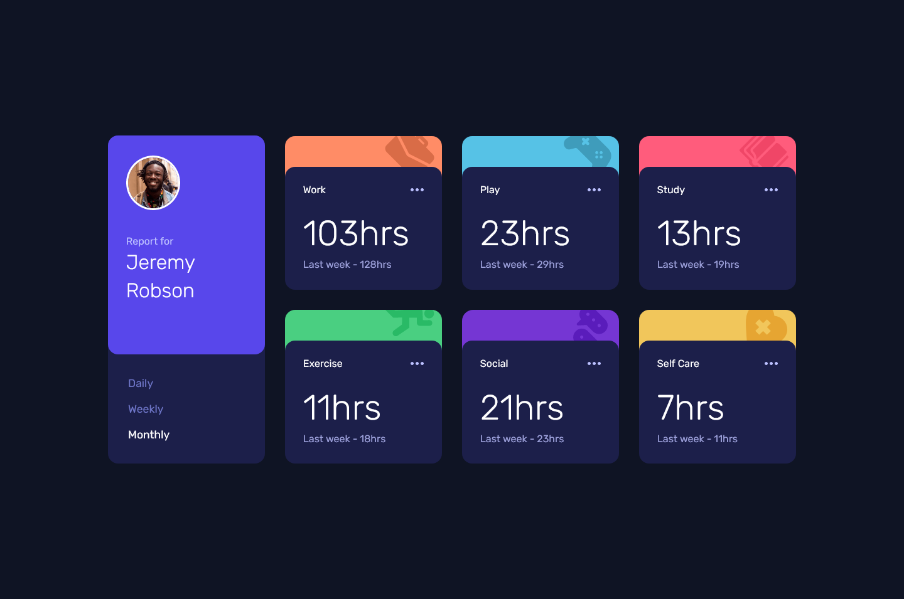

# Frontend Mentor - Time tracking dashboard solution

This is a solution to the [Time tracking dashboard challenge on Frontend Mentor](https://www.frontendmentor.io/challenges/time-tracking-dashboard-UIQ7167Jw). Frontend Mentor challenges help you improve your coding skills by building realistic projects. 

## Overview

### The challenge

Users should be able to:

- View the optimal layout for the site depending on their device's screen size
- See hover states for all interactive elements on the page
- Switch between viewing Daily, Weekly, and Monthly stats

### Screenshot



### Links

- Live Site URL: [Link](https://emiacerbi.github.io/time-tracking-dashboard/)

## My process

### Built with

- Semantic HTML5 markup
- CSS custom properties
- Flexbox
- CSS Grid
- Mobile-first workflow
- [React](https://reactjs.org/) - JS library
- [Sass](https://sass-lang.com/) - For styles

### What I learned

I wanted to practice a little bit with ternary operators and so I refactored a multiple line function into this. 

```JS
    const dataTitles = data.map(({title, timeframes: {daily, weekly, monthly}}) => {

    const checkTime = (period) => time === 'daily' ? daily[period] : time === 'weekly' ? weekly[period] : monthly[period]
```

## Author

`Emiliano Acerbi`

## Acknowledgments

Thanks to Frontend Mentor for the cool projects to practice and get better at developing. I really like the page.
